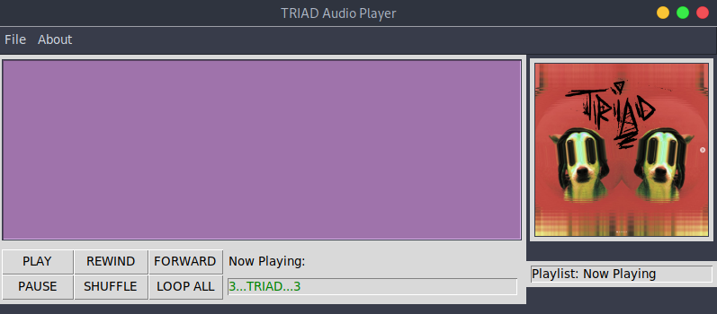
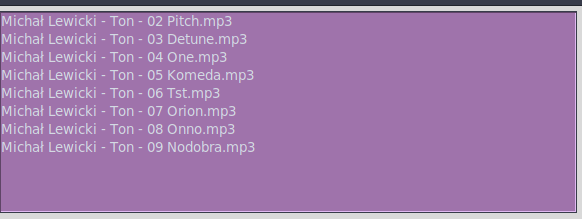
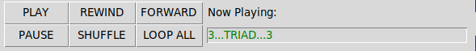
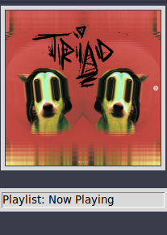
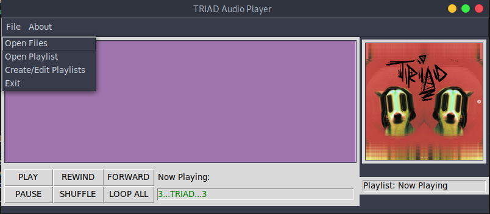
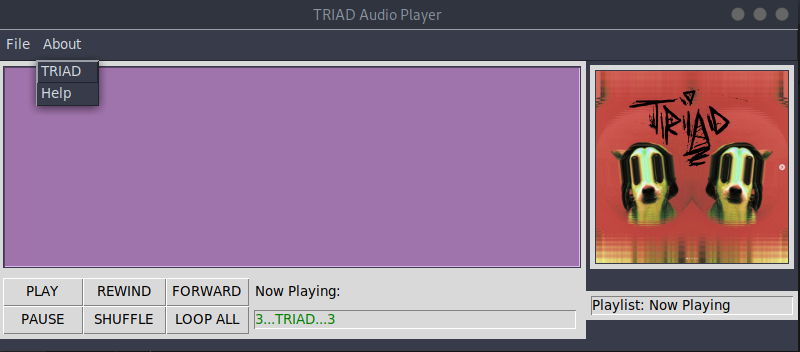
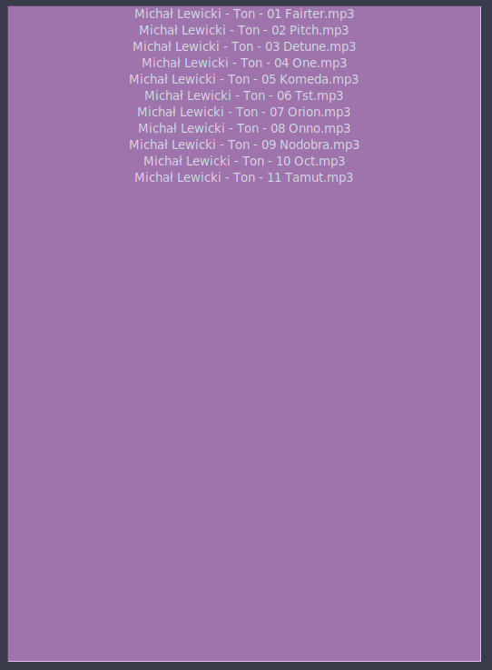
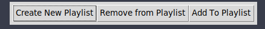
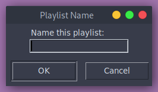

# TRIAD audio player

## Introduction
**TRIAD** is a simple audio player written in Python by pc84. It has been a fun way to wrap my love of code and music into a project I can use and continue to build on FOREVER!!! In it's current iteration, TRIAD only supports the MP3 audio file format. In future iterations, there are 3 audio formats I want to be sure are supported: MP3, WAV, FLAC (Hence: TRIAD audio). TRIAD audio player has two display windows: The Main Player Window and the Playlist Editor Window.

---

## Main Player Window

### The Main Player Window can be broken into Four parts:

1. **Now Playing Window**
    
    

    * Displays all the files/songs currently staged for playback.
    * Files can be played by double clicking them in the window.

2. **Core Functions** 

     

    * **Song Now Playing**: A small window that displays the song currently playing displayed in green text.
    
    * **PLAY**
    The PLAY button will start audio playing. It is the default behavior of the player to start playing once you've chosen files to open. It is most used when you open a playlist or want to resume playing the last played files from when you last exited the program.

    * **FWD/Skip Forward**
    The FWD button will skip to the next audio file in your Now Playing list. If you are at the end of the list, it will simply start at the beginning of your list.

    * **RWD/Skip back**
    The RWD button has two functions. It will rewind to the beginning of the track that is currently playing. If you intend to skip back to the track prior to the one you are playing, simply click the button within the first two seconds of the track playing and it will do that for you!

    * **PAUSE/RESUME**
    The PAUSE button will pause all audio playing and you will see the label of the button change to say "RESUME". Clicking RESUME will resume audio playback from where it was paused initially and the label will return to "PAUSE". 

    * **SHUFFLE**
    The Shuffle button will randomise the order of audio playback. Currently this change is not represented in your now playing window.

    * **LOOP ALL / LOOP ONE**
    The LOOP ALL button will initiate either an infinite loop of all the tracks in your now playing list, or it will loop one track repeatedly. The default behavior of TRIAD is to Loop All tracks. This Button label represents the current state of looping and pressing it changes that state.

3. **Album Art Window**

    * On first launch, the TRIAD audio alien dog mascot is displayed. 
    * When songs are selected, TRIAD finds any associated album art and displays it here.
    * Underneath the Album art, the name of the playlist is displayed.

       

4. **Menu Bar**
    * **File**
        
        
    
        - **Open File(s)**: Opens files to be played!
            * Selecting multiple songs: Holding Ctrl as you Click (CTRL + CLICK) lets you pick multiple 'scattered' files(1, 4, 7) within the same folder. Holding Shift while you Click (SHIFT+CLICK) lets you select a group of files in succession (1-10) within the same folder. Click + Drag are not supported to select files.
        - **Open Playlist**: Choose a pre-saved playlist to be opened and played.
        - **Create/Edit Playlists**: Launches the Playlist Editor Window.
        - **Exit**: Closes the program.
            * When closing the window, TRIAD saves the Now Playing list to memory so when you re-open the program, the last thing you were listening to is waiting for you like an old friend!
    * **About**

       
    
        - **TRIAD**: Tells you a little about this little audio player.
        - **Help**: Shares this GITHUB page address.

---

## Playlist Editor Window
### The Playlist Editor Window can be broken into two parts:

1. **The Playlist Editor Window**: Displays playlists as they are being created or edited.

2. **The Playlist Editor Function Buttons**

    

    * **Create New Playlist**: Asks you to name the playlist and then asks which files to add. The files you have chosen will be displayed in the Editor Window.

    

    * **Remove from Playlist**: Asks which Playlist you want to edit. Then asks which files you'd like removed. The changes will be displayed in the Editor Window.
    * **Add To Playlist**: Asks which Playlist you want to edit. Then asks which files you'd like to add. The changes will be displayed in the Editor Window.
* **NOTE**: This is only a way to View, Edit and Create Playlists. If you want to listen to a playlist you've created, you must return to the main player window and choose "Open Playlist" from the File drop down menu.

---

## To Do 
### In the future many more features can be added!
* Accept FLAC/WAV
* Light/Dark Mode
* In player Volume setting
* Progress bar for songs
* Visualizer for music
    * Eq Bars
    * Spirograph
    * Wav forms
    * Color Hues
* Themes/Skins
* Pop out mini player
* Package as executable for any system
* In file list use bpm to move through letters of playing song-make a letter switch to caps then back to lower.
* Each track randomly generates art that can be viewed and saved.

## **Thank you for exploring TRIAD! Your feedback is welcome and participation is encouraged!**